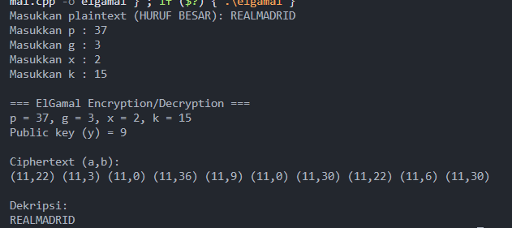

Program kedua adalah implementasi algoritma ElGamal. Program ini menggunakan parameter berupa bilangan prima p, generator g, kunci privat x, dan bilangan acak k. Dari parameter tersebut dihitung kunci publik y dengan rumus g pangkat x modulo p. Plaintext yang dimasukkan pengguna dikonversi menjadi bilangan dengan pemetaan huruf A sama dengan 0 hingga Z sama dengan 25. Proses enkripsi dilakukan dengan menghitung nilai a sama dengan g pangkat k modulo p, serta shared secret s sama dengan y pangkat k modulo p. Setiap huruf plaintext m kemudian dienkripsi menjadi pasangan ciphertext (a,b) dengan b sama dengan m dikalikan s modulo p. Untuk mendekripsi, penerima menghitung kembali shared secret s dengan rumus a pangkat x modulo p, kemudian mencari invers modulo dari s. Setiap huruf plaintext didapat kembali dengan menghitung m sama dengan b dikalikan invers dari s modulo p, dan nilai angka tersebut dikonversi kembali menjadi huruf kapital. Program ini menampilkan ciphertext dalam bentuk pasangan bilangan (a,b) dan hasil dekripsi yang identik dengan plaintext asli.

Berikut ini hasil running programnya

