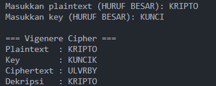

Program pertama adalah implementasi Vigenere Cipher. Program ini meminta masukan berupa plaintext dan key yang ditulis dengan huruf besar. Key yang diberikan kemudian diperpanjang hingga panjangnya sama dengan plaintext menggunakan fungsi khusus, sehingga setiap huruf dalam teks memiliki pasangan huruf kunci. Proses enkripsi dilakukan dengan menambahkan nilai huruf plaintext dengan huruf key menggunakan operasi modulo 26. Hasil perhitungan kemudian dikonversi kembali menjadi huruf kapital sehingga membentuk ciphertext. Untuk dekripsi, program mengurangi nilai huruf ciphertext dengan huruf key menggunakan operasi modulo 26 yang sama, lalu mengubah hasilnya kembali menjadi huruf kapital, sehingga plaintext asli dapat diperoleh kembali. Program ini menampilkan plaintext awal, key yang sudah dipanjangkan, hasil enkripsi berupa ciphertext, dan hasil dekripsi yang identik dengan plaintext.

Berikut ini hasil running programnya

